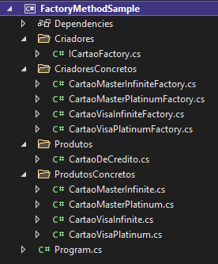
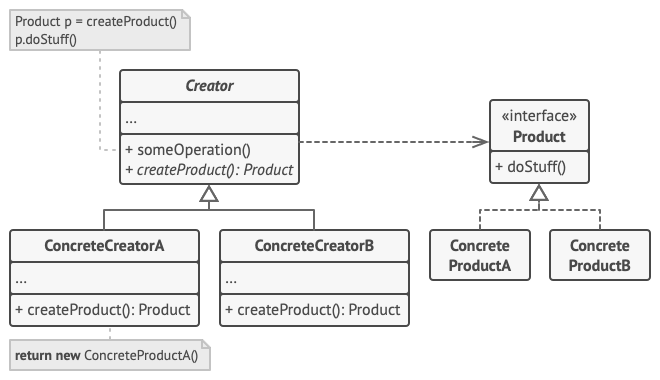

author: Vaivoa
summary: Implementação do Design Pattern Factory Method
id: design-pattern-factory-method
categories: codelab,markdown
environments: Web
status: Published
feedback link: https://github.com/Vaivoa/design-pattern-factory-method
analytics account: Google Analytics ID

# Factory Method Design Pattern

## Antes de Começar

Duration: 2:30

Aqui vamos aprender a implementar o Factory Method. Se você quer entender mais das razões para utilizar esse pattern, seus prós e contras, dá uma olhada lá no post que fizemos no [nosso blog](link para o dev.to)

### O que você vai criar:

* Uma mini aplicação utilizando o design pattern Factory Method.



### O que você vai aprender:

* Como aplicar Factories em seu código;



### O que é necessário:

* Um editor de texto e qualquer linguagem de programação orientada a objetos. Aqui utilizei a IDE Visual Studio e C#, mas sinta-se livre para utilizar o que preferir.


## Cliente

Duration: 3:00

Como exemplo para implementação desse código utilizei a situação onde o usuário está fazendo um pedido para receber um cartão de crédito. O programa não sabe de antemão qual será o tipo do cartão que o usuário irá pedir e cada cartão tem alguns atributos que o diferenciam dos outros. Além disso, o usuário também irá informar o nome que gostaria de ter no cartão e o seu limite dentro de um intervalo especificado. Não irei expor o código que recebe os inputs do usuário por não ser o foco aqui.  
Abaixo podemos ver o código cliente de nossa factory na forma como ele será reproduzido.

```csharp
        static void Main()
        {
            var nome = ReceberInputNome();
            var limite = ReceberInputLimite();
            var tipoDeCartao = ReceberInputTipoCartao().ToLower();
            var cartao = GerarNovoCartao(tipoDeCartao, nome, limite);

            Console.WriteLine("\nOs dados do seu novo cartão são: ");
            Console.WriteLine(cartao.ToString());

            Console.WriteLine($"\nSimulando compra...");
            cartao.Cashback();
        }
```

Para evitar acoplar o código e ser forçado a realizar alterações na minha factory toda vez que eu fosse estender a aplicação adicionando mais cartões, optei por deixar a lógica de selecionar o objeto a ser criado dentro do cliente, porém não vejo problema nenhum em manter esse método dentro da factory, assim tiraríamos mais uma responsabilidade de quem vai utiliza-la. Cabe a quem estiver desenvolvendo considerar o que vale mais a pena. Aqui optei por fazer dessa forma, mantendo as classes mais limpas para o tutorial.  
P.S.: A Exception também não era o foco, use o bom senso.

```csharp
        public static CartaoDeCredito GerarNovoCartao(string tipoCartao,
                                                      string nome,
                                                      int limite)
        {
            return tipoCartao switch
            {
                "visa infinite" => new CartaoVisaInfiniteFactory()
                    .GerarCartao(nome, limite),
                "master infinite" => new CartaoMasterInfiniteFactory()
                    .GerarCartao(nome, limite),
                "visa platinum" => new CartaoVisaPlatinumFactory()
                    .GerarCartao(nome, limite),
                "master platinum" => new CartaoMasterPlatinumFactory()
                    .GerarCartao(nome, limite),
                _ => throw new Exception("Deu ruim."),
            };
        }
```

Olhando esse código já temos uma visão das vantagens que a abstração de implementar uma factory nos trás. Sem ter ideia de que tipo de cartão o cliente irá pedir, o código já o trata como objeto criado e chama seus métodos como ``ToString()`` e ``Cashback()``.  
Nas próximas etapas veremos como isso é implementado.

## Produto Abstrato

Duration: 4:00

O Produto é a classe base que será usada como tipo para nossos produtos concretos. Aqui, todos os cartões são cartões de crédito, independente de que bandeira o usuário escolher para si.  
Podemos utilizar Classes Abstratas ou Interfaces como base para nossos produtos. A Interface é mais leve e permite que os produtos concretos herdem de mais de uma classe base se isso for do seu interesse. A classe Abstrata permite que já realizemos aqui a implementação de algumas partes do código que serão iguais para todos os cartões, já que as subclasses herdarão o que implementarmos na classe base. Nesse projeto foi interessante utilizar a Classe Abstrata.

```csharp
namespace FactoryMethodSample
{
    public abstract class CartaoDeCredito
    {
        public string Nome { get; }
        public DateTime Validade { get; }
        public string Bandeira { get; }
        public string? Numero { get; init; }
        public int CodigoSeguranca { get; }
        public int LimiteTotal { get; protected set; }
        public decimal LimiteDisponivel { get; protected set; }

        protected CartaoDeCredito(string nome, 
                                  string bandeira, 
                                  int limiteTotal)
        {
            Nome = nome;
            Validade = DateTime.Today.AddYears(5);
            Bandeira = bandeira;
            CodigoSeguranca = new Random().Next(100, 999);
            LimiteTotal = limiteTotal;
            LimiteDisponivel = limiteTotal;
        }

        public virtual void AtualizarLimiteTotal(int limiteTotal)
        { 
            LimiteTotal = limiteTotal;
        }
        
        public virtual void AtualizarLimiteDisponivel(decimal valorGasto)
        { 
            LimiteDisponivel -= valorGasto; 
        }

        public abstract string GerarNumeroCartao();
        public abstract void Cashback();

        public override string ToString()
        {
            return $"Nome: {Nome}\n" +
                   $"Número: {Numero}\n" +
                   $"Bandeira: {Bandeira}\n" +
                   $"CVV: {CodigoSeguranca}\n" +
                   $"Limite Total: {LimiteTotal}\n" +
                   $"Limite Disponível: {LimiteDisponivel}\n" +
                   $"Validade: {Validade}";
        }
    }
}
```

Antes de pular para o próximo passo note como alguns comportamentos da classe foram marcados como _virtual_, permitindo ser sobrescritos se necessário, outros são _abstract_ forçando com que as subclasses fornceçam uma implementação para aquele comportamento. Também há o _override_ do método ``ToString()`` que está ali e será herdado por todas as subclasses. E por último o construtor e atributos, que também serão herdados, podendo ser extendidos dentro de cada subclasse, e nos poupam repetição de código.


## Produtos Concretos

Duration: 2:00

Os produtos concretos são os objetos que serão criados pelo cliente através das factories. Eles extendem a classe base fazendo as modificações pontuais necessárias para se diferenciarem um dos outros.

```csharp
namespace FactoryMethodSample
{
    public class CartaoMasterPlatinum : CartaoDeCredito
    {
        public CartaoMasterPlatinum(string nome, int limiteTotal)
            : base(nome, "Master Platinum", limiteTotal)
        {
            Numero = GerarNumeroCartao();
        }

        public override string GerarNumeroCartao()
        {
            var rnd = new Random();
            int cardNumber1 = rnd.Next(5001, 5599);
            int cardNumber2 = rnd.Next(1000, 9999);
            int cardNumber3 = rnd.Next(1000, 9999);
            int cardNumber4 = rnd.Next(1000, 9999);

            return $"{cardNumber1}{cardNumber2}{cardNumber3}{cardNumber4}";
        }

        public override void Cashback()
        {
            Console.WriteLine("Após a compra o usuário recebeu 1,2% de cashback");
        }
    }
}
```

Aqui o produto Cartão Master Platinum adiciona ao construtor a geração de número do cartão. Método que ele faz a implementação, que estava como abstrato na classe base. Ele também implementa o comportamento de cashback, que foi feito de forma simplificada somente para demonstração.  
Cada subclasse de ``CartãoDeCredito`` irá fazer sua própria implementação desses dois métodos. Como no outro exemplo abaixo.

```csharp
namespace FactoryMethodSample
{
    public class CartaoVisaInfinite : CartaoDeCredito
    {
        public CartaoVisaInfinite(string nome, int limiteTotal)
            : base(nome, "Visa Infinite", limiteTotal)
        {
            Numero = GerarNumeroCartao();
        }

        public override string GerarNumeroCartao()
        {
            var rnd = new Random();
            int cardNumber1 = rnd.Next(4001, 4799);
            int cardNumber2 = rnd.Next(1000, 9999);
            int cardNumber3 = rnd.Next(1000, 9999);
            int cardNumber4 = rnd.Next(1000, 9999);

            return $"{cardNumber1}{cardNumber2}{cardNumber3}{cardNumber4}";
        }

        public override void Cashback()
        {
            Console.WriteLine("Após a compra o usuário recebeu 2,5% de cashback");
        }
    }
}
```

## Interface de Fábrica

Duration: 1:00

Para nossas fábricas usei uma Interface ao invés da Classe Abstrata pois não havia nada para implementar em sua base. Então basta declarar o método que será implementado pelas subclasses. Cada uma deverá conter o comportamento de GerarCartao que retorna um ``CartaoDeCredito``, mas que na verdade é um cartão do tipo que o usuário requisitar. 

```csharp
namespace FactoryMethodSample
{
    public interface ICartaoFactory
    {
        // Factory Method
        public CartaoDeCredito GerarCartao(string nome, int limite);
    }
}
```

## Fábricas Concretas

Duration: 2:00

Aqui de forma muito simples implementamos o Factory Method de forma que ele retorne o cartão de acordo com a classe que estamos criando. Para isso é aqui que chamaremos o construtor desse cartão.

```csharp
namespace FactoryMethodSample
{
    public class CartaoMasterPlatinumFactory : ICartaoFactory
    {
        public CartaoDeCredito GerarCartao(string nome, int limite)
        {
            return new CartaoMasterPlatinum(nome, limite);
        }
    }
}
```

Como citei sobre o switch na parte sobre o código cliente, ele também poderia estar aqui, nos poupando de criar uma classe Factory para cada tipo de cartão que tivermos. Fica a critério como implementar de maneira que faça mais sentido para sua situação.

## Código Funcionando

Duration: 1:00

Abaixo estão dois exemplos de como o código se comporta em funcionamento.


## Conclusão

Duration: 00:30

Muito bem! Vimos como implementar o Factory Method e falamos um pouco sobre opções que temos para adptá-lo de forma a se encaixar em nossas necessidades. Em nosso exemplo foi uma implementação simples, mas totalmente preparada para extensão.  
Se quiser pode baixar o código completo desse tutorial [aqui]()
Sinta-se a vontade para comentar e dar sugestões lá no nosso [GitHub]() ou no nosso [blog]() no Dev.To. Até mais!